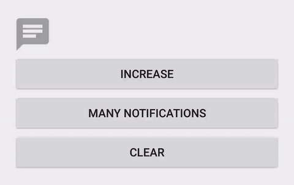

# NotificationBadge

A notification badge with animation.




## Gradle

```
compile 'com.nex3z:notification-badge:0.2.0'
```


## Usage

Use `setNumber(int number)` or `setText(String text)` to add number or arbitrary text on the badge. Use `clear()` to clear the badge.


## Attributes

| Attribute           | Format    | Description                                                                                                |
|---------------------|-----------|------------------------------------------------------------------------------------------------------------|
| nbTextSize          | dimension | Text size.                                                                                                 |
| nbTextColor         | color     | Text color.                                                                                                |
| nbBackground        | reference | Badge background image.                                                                                    |
| nbAnimationEnabled  | boolean   | `true` to enable animation, `false`to disable it. The default is `true`.                                   |
| nbAnimationDuration | integer   | Duration of the animation in milliseconds. The default is `500` milliseconds.                              |
| nbMaxTextLength     | integer   | Max text length allowed to show on the badge. The default is `2`.                                          |
| nbEllipsizeText     | string    | Special text to show when the length of the original text reaches `nbMaxTextLength`. The default is `...`. |
